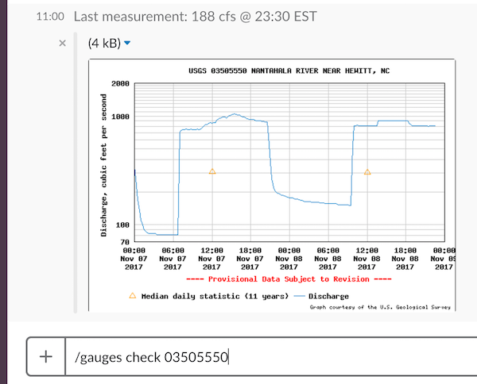

# River Guages Slack App

AWS Serverless Application Model (SAM) example for AWS on Tap.

https://www.meetup.com/AWS-On-TAP/events/244064304/

## Development setup

Install dependencies.

* [AWS CLI](https://aws.amazon.com/cli/)
* [Python 2.7](https://www.python.org/download/releases/2.7/)
* [Virtualenv](http://docs.python-guide.org/en/latest/dev/virtualenvs/)
* [Make](https://www.gnu.org/software/make/)

Configure the local python development environment.

    virtualenv venv
    source venv/bin/activate
    pip install -r requirements.txt

Create a DynamoDB table to use for development.

    aws dynamodb create-table \
        --table-name favorite-gauges-dev \
        --attribute-definitions AttributeName=USGSSiteNumber,AttributeType=S \
        --key-schema AttributeName=USGSSiteNumber,KeyType=HASH \
        --provisioned-throughput=ReadCapacityUnits=5,WriteCapacityUnits=5

Configure the gauges app for local development.

    export kmsEncryptedToken=local
    export favoriteGaugesTable=favorite-gauges-dev

Run the /gauges command locally.

    python gauges.py help
    python gauges.py add 08057200 White Rock Creek
    python gauges.py list
    python gauges.py check 08057200

## Deployment

    export APP_ENV=stage
    make

## Slack app setup

See the Slack docs on how to set up a slash command.

https://api.slack.com/slash-commands
